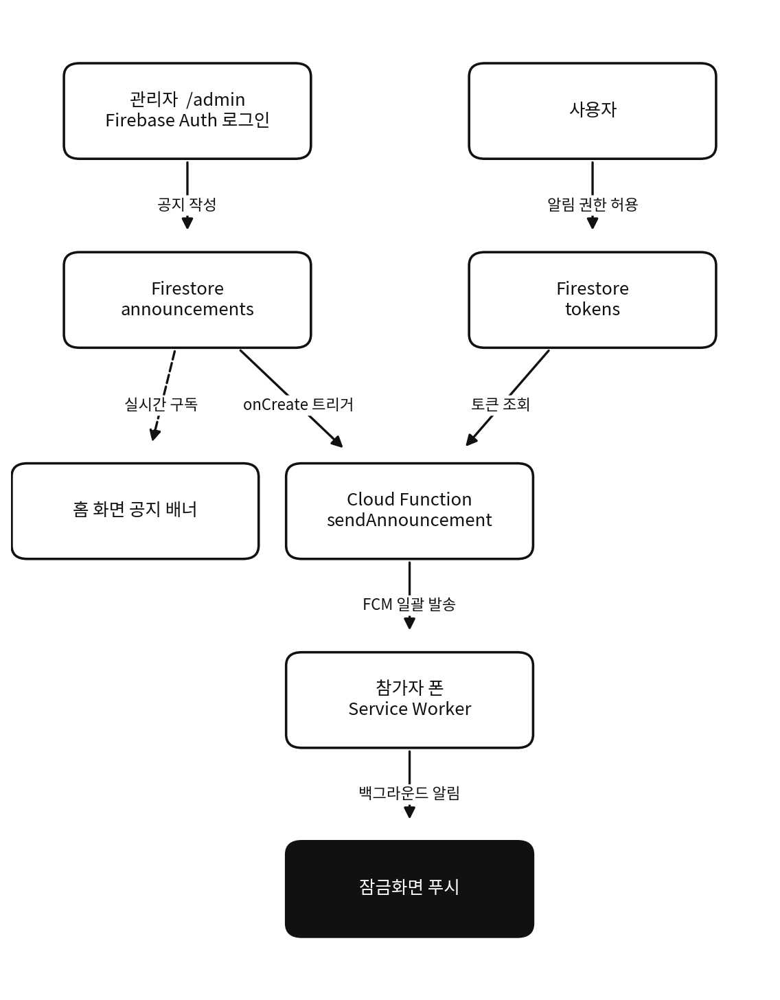

# 로뎀 청년대학부 여름말씀캠프 PWA

> QR 코드로 설치하고, 관리자 공지를 전 참가자 폰에 **실시간 푸시 알림**으로 전달하는 캠프 전용 프로그레시브 웹앱(PWA).

<p>
  
  
  
  
  
</p>

🔗 **Live demo:** https://rodemcamp.web.app

📐 **디자인 기록:** [DESIGN.md](DESIGN.md)

---

## 프로젝트 소개

교회 청년대학부 여름 캠프(80~100명, 3박 4일)를 위해 직접 만든 모바일 웹앱이다.
앱스토어 심사 없이 **QR 코드 스캔만으로 설치**할 수 있고, 캠프 일정·방배정·말씀 본문을
오프라인에서도 확인할 수 있으며, 운영진이 입력한 공지가 **모든 참가자의 폰에 푸시 알림**으로
즉시 전달된다.

처음 기획부터 배포까지 직접 진행했으며, iOS의 까다로운 PWA 푸시 제약과
서비스워커 충돌 등 실제 프로덕션에서 마주치는 문제들을 해결한 것이 핵심이다.

---

## 첨부 사진

| 홈 | 일정 | 공지 푸시 |
|---|---|---|
|  |  |  |

---

## ✨ 주요 기능

- **실시간 공지 푸시** — 관리자가 공지 작성 → 전 사용자 폰에 백그라운드 푸시 알림
- **공지 실시간 반영** — Firestore 구독으로 앱을 열면 최신 공지가 홈 중앙에 표시
- **공지 상세 및 목록** — 홈에서 최신 공지를 보여주고, 상세 페이지와 전체 목록 페이지로 모든 공지를 확인
- **상대시간 표시** — 공지에 just now, N분 전 형식의 상대시간 표기
- **스플래시 화면** — 앱 진입 시 아이콘에서 로딩 막대를 거쳐 홈으로 이어지는 진입 연출
- **PWA 앱 아이콘** — 홈 화면 설치 시 브랜드 색을 반영한 전용 아이콘 표시
- **QR 설치형 PWA** — 앱스토어 없이 홈 화면에 설치, 네이티브 앱 같은 경험
- **오프라인 대응** — 서비스워커 캐싱으로 캠프장 네트워크가 불안정해도 조회 가능
- **관리자 전용 페이지** — Firebase Auth 로그인 기반 공지 작성/발송
- **사진 탭** — 하단 탭에서 Google Photos 공유 앨범 연동
- **캠프 일정 / 방배정 / 말씀 본문** — 일자별 타임라인, 이름·방 검색, 강의별 본문 아코디언
- **5개 하단 탭** — 홈·일정·말씀·방배정·사진으로 구성

---

## 아키텍처



- **DB**: Firestore — `announcements`(공지), `tokens`(FCM 토큰)
- **푸시**: Firebase Cloud Messaging (웹 푸시 / VAPID)
- **발송 서버**: Cloud Functions (Firestore `onCreate` 트리거 → 전체 토큰 일괄 발송 + 만료 토큰 자동 정리)
- **인증**: Firebase Auth (관리자 이메일/비밀번호)
- **호스팅**: Firebase Hosting

---

## 기술 스택

| 구분 | 기술 |
|---|---|
| Frontend | React 18, React Router, Vite 5 |
| Styling | Tailwind CSS |
| Font | Gowun Batang, Hahmlet |
| PWA | vite-plugin-pwa (Workbox, injectManifest) |
| Backend | Firebase Firestore, Cloud Functions, Auth |
| Push | Firebase Cloud Messaging (FCM) |
| Hosting | Firebase Hosting |

---

## 기술적으로 신경 쓴 점

실제 배포 과정에서 마주친 문제와 해결 방법이다.

### 1. iOS PWA 푸시 알림 제약 대응
iOS는 16.4부터만 웹 푸시를 지원하며, **반드시 "홈 화면에 추가" 후 설치된 앱으로
실행한 상태**에서만 권한 요청·수신이 가능하다. 이를 고려해 온보딩 흐름과
안내 문구를 설계하고, 권한이 이미 허용된 경우 "알림 받기" 버튼을 숨겨
UI를 단순화했다.

### 2. 서비스워커 충돌 해결 (injectManifest)
`vite-plugin-pwa`의 기본 `generateSW`는 자체 서비스워커를 생성하는데,
FCM 백그라운드 수신용 서비스워커와 루트 스코프에서 충돌한다.
**`injectManifest` 전략으로 전환**해 단일 커스텀 서비스워커(`src/sw.js`)가
오프라인 캐싱(Workbox)과 FCM 백그라운드 수신을 모두 담당하도록 통합했다.

### 3. 푸시 중복 수신 버그 해결
`notification` 페이로드를 보내면 FCM SDK가 알림을 자동 표시하고,
동시에 `onBackgroundMessage` 핸들러가 또 표시해 **알림이 2번** 오는 문제가 있었다.
**`data` 페이로드로 전환**해 서비스워커에서 한 번만 표시하도록 수정했다.

### 4. 비용 최적화
Cloud Functions의 컨테이너 이미지 정리 정책(1일)을 설정해 불필요한
Artifact Registry 스토리지 비용을 방지했고, 일정·방배정처럼 변동 없는 데이터는
DB 대신 정적 파일로 두어 읽기 비용을 최소화했다.

### 5. iOS PWA 상태바와 설치 특성
iOS는 `theme-color`로 상태바를 단색으로 칠하며, `apple-mobile-web-app-status-bar-style`은
홈 화면 추가 시점에만 읽혀 값을 바꾸면 재설치가 필요하다. 이를 고려해 상태바 처리를
설계했다. Android는 상태바를 OS가 칠하는 단색으로 표시하므로 매니페스트 `theme_color`로 맞춘다.

### 6. 다이어그램 렌더링 안정화
GitHub에서 Mermaid 렌더링이 깨지는 문제가 있어, 아키텍처 다이어그램을 PNG 이미지로
교체해 어디서든 동일하게 보이도록 했다.

---

## 프로젝트 구조

```
camp-app/
├─ src/
│  ├─ pages/         # Home, Schedule, Rooms, Verses, Admin,
│  │                 #   Announcements, AnnouncementDetail
│  ├─ components/    # BottomNav, PageHeader, SplashScreen
│  ├─ data/          # 일정·방배정·말씀 (정적 데이터)
│  ├─ lib/push.js    # 알림 권한 요청 + FCM 토큰 등록
│  ├─ lib/time.js    # 상대시간 포맷 (just now, N분 전)
│  ├─ firebase.js    # Firebase 초기화
│  └─ sw.js          # 서비스워커 (캐싱 + FCM 백그라운드)
├─ functions/        # Cloud Function (공지 푸시 발송)
├─ firestore.rules   # Firestore 보안 규칙
└─ vite.config.js    # PWA 설정 (injectManifest)
```

---

## 로컬 실행

```bash
npm install
cp .env.local.example .env.local   # Firebase 설정값 입력
npm run dev
```

### 배포

```bash
npm run build
npx firebase-tools deploy --only hosting
```

---

## 향후 계획

- [ ] 일정,방배정을 Firestore로 옮겨 관리자 페이지에서 실시간 편집
- [ ] 포그라운드 알림 인앱 토스트 표시
- [ ] GitHub Actions 기반 CI/CD 자동 배포
- [ ] 홈 위젯 추가
